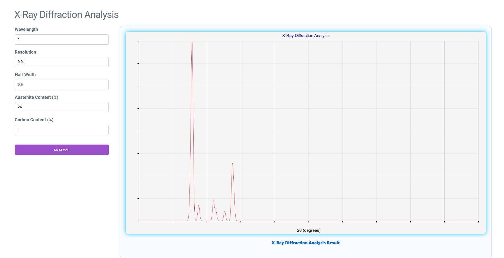

# X-Ray Diffraction Analysis Web App

This project is a full-stack web application for simulating and visualizing X-Ray Diffraction (XRD) analysis. It consists of a C# ASP.NET Core backend for scientific calculations and chart generation, and a modern React frontend for user interaction.

## Screenshots


*X-Ray Diffraction Analysis web interface showing input parameters and generated diffraction pattern*

## Features
- **XRD Simulation**: Calculates and visualizes X-Ray diffraction patterns based on user input parameters (wavelength, resolution, half width, austenite content, carbon content). All input fields are now optional.
- **Dynamic Chart Generation**: The backend generates a high-quality PNG chart of the simulated XRD pattern.
- **Modern UI**: The frontend provides a clean, responsive interface for input and result display.
- **REST API**: The backend exposes an API endpoint for analysis, easily integrable with other clients.
- **Improved Serialization**: API result fields are now explicitly named for better frontend/backend integration.
- **Production Ready**: HTTPS redirection is enabled in production for security.

## Project Structure
```
X-Ray-Diffraction/
├── src/
│   ├── backend/         # ASP.NET Core Web API (C#)
│   │   ├── Controllers/ # API controllers
│   │   ├── Models/      # Data models
│   │   ├── Program.cs   # App entry point
│   │   └── ...
│   └── xray-frontend/   # React frontend (JavaScript)
│       ├── src/         # React source code
│       └── ...
├── X-Ray-Diffraction.sln
└── ...
```

## Getting Started

### Prerequisites
- [.NET 9 SDK](https://dotnet.microsoft.com/en-us/download/dotnet/9.0)
- [Node.js & npm](https://nodejs.org/)

### Backend Setup (C# ASP.NET Core)
1. Navigate to the backend directory:
   ```sh
   cd src/backend
   ```
2. Restore dependencies and run the API:
   ```sh
   dotnet restore
   dotnet run
   ```
   The API will start (default: `http://localhost:5004`).

### Frontend Setup (React)
1. Navigate to the frontend directory:
   ```sh
   cd src/xray-frontend
   ```
2. Install dependencies and start the app:
   ```sh
   npm install
   npm start
   ```
   The app will open at `http://localhost:3000`.

### Usage
1. Open the frontend in your browser (`http://localhost:3000`).
2. Enter the required parameters:
   - **Wavelength**: X-ray wavelength (e.g., 1.54 Å for Cu Kα)
   - **Resolution**: Angular resolution in degrees
   - **Half Width**: Peak half-width parameter
   - **Austenite Content**: Percentage of austenite phase
   - **Carbon Content**: Carbon content percentage
3. Click **Analyze** to generate the XRD pattern.
4. The generated chart will display the diffraction peaks vs. 2θ (degrees).
5. For data export, add `?format=csv` to the API endpoint to download raw data.

## API Reference

### POST `/api/analysis/analyze`
- **Request Body** (JSON):
   - `wavelength` (number, optional)
   - `resolution` (number, optional)
   - `halfWidth` (number, optional)
   - `austeniteContent` (number, %, optional)
   - `carbonContent` (number, %, optional)
- **Response**: PNG image of the XRD chart.

#### AnalysisResult (JSON, for future use)
```json
{
   "xData": [1.0, 2.0, ...],
   "yData": [10.0, 20.0, ...]
}
```

## Deployment
- Both backend and frontend include Dockerfiles for containerized deployment.
- See `src/docker-compose.yml` for multi-container orchestration.

## License
See [LICENSE](LICENSE).

## Contributing
Pull requests are welcome! For major changes, please open an issue first to discuss what you would like to change.

## Author
Krzysztof Zając
